# Architecture Diagram

Clean Architecture (DDD) with 4 layers. Dependencies point inward — outer layers depend on inner, never the reverse.

```mermaid
graph TB
    subgraph CLI["Interfaces Layer — CLI"]
        TRAIN["train.py\n(argparse → Trainer)"]
        EVAL["evaluate.py\n(argparse → Evaluator)"]
    end

    subgraph PZ["Interfaces Layer — PettingZoo"]
        PZENV["BattleRoyaleEnv\nParallelEnv adapter\nobs/action spaces"]
    end

    subgraph APP["Application Layer"]
        TRAINER["Trainer\nPPO via SB3\nwraps vec env"]
        EVALUATOR["Evaluator\nwin rate / ep length"]
        POOL["SnapshotPool\nrotating .zip checkpoints"]
        TRACKER["MetricsTracker\naggregates stats"]
    end

    subgraph INFRA["Infrastructure Layer"]
        MJENV["MuJoCoEnvironment\nimplements IBattleRoyaleEnv"]
        XML["XMLBuilder\ngenerates MJCF XML"]
        WANDB["WandBLogger\nimplements ILogger"]
        YAML["YamlLoader / Config"]
        VIDEO["VideoRecorder"]
    end

    subgraph DOMAIN["Domain Layer (core)"]
        subgraph ENTITIES["Entities"]
            AGENT["Agent\nid, position, velocity, alive"]
            ARENA["Arena\nradius"]
        end
        subgraph SERVICES["Domain Services"]
            ELIM["EliminationService\nout-of-bounds check"]
            OBS["ObservationBuilder\n17-dim obs vector"]
            REWARD["RewardCalculator\nkill/death/survival rewards"]
        end
        subgraph IFACES["Interfaces (Protocols)"]
            IENV["IBattleRoyaleEnv"]
            IPOL["IPolicy"]
            ILOG["ILogger"]
        end
    end

    %% CLI wires everything
    TRAIN -->|"creates"| MJENV
    TRAIN -->|"creates"| PZENV
    TRAIN -->|"creates"| TRAINER
    TRAIN -->|"loads"| YAML

    EVAL -->|"creates"| EVALUATOR
    EVAL -->|"loads"| YAML

    %% Application → Interfaces
    TRAINER -->|"trains on"| PZENV
    TRAINER -->|"saves snapshots"| POOL
    TRAINER -->|"logs"| WANDB
    TRAINER -->|"records"| TRACKER

    EVALUATOR -->|"loads snapshot"| POOL
    EVALUATOR -->|"logs"| WANDB
    EVALUATOR -->|"creates env via factory"| PZENV

    TRACKER -->|"forwards"| WANDB

    %% PettingZoo → Domain + Infra
    PZENV -->|"wraps"| IENV
    PZENV -->|"calls"| OBS
    MJENV -.->|"implements"| IENV

    %% Infrastructure → Domain
    MJENV -->|"builds xml"| XML
    MJENV -->|"calls"| ELIM
    MJENV -->|"calls"| REWARD
    MJENV -->|"produces"| AGENT
    MJENV -->|"uses"| ARENA
    WANDB -.->|"implements"| ILOG

    %% Domain services use entities
    ELIM -->|"reads"| AGENT
    ELIM -->|"reads"| ARENA
    OBS -->|"reads"| AGENT
    OBS -->|"reads"| ARENA
    REWARD -->|"reads"| AGENT

    %% Styling
    classDef domain fill:#1e3a5f,color:#fff,stroke:#4a90d9
    classDef infra fill:#2d4a1e,color:#fff,stroke:#6ab04c
    classDef app fill:#4a2d1e,color:#fff,stroke:#d4804a
    classDef iface fill:#3a1e4a,color:#fff,stroke:#9b59b6

    class AGENT,ARENA,ELIM,OBS,REWARD,IENV,IPOL,ILOG domain
    class MJENV,XML,WANDB,YAML,VIDEO infra
    class TRAINER,EVALUATOR,POOL,TRACKER app
    class TRAIN,EVAL,PZENV iface
```



## Layer Summary

| Layer | Responsibility | Key Components |
|-------|---------------|----------------|
| **Domain** | Core business logic, no external deps | `Agent`, `Arena`, `EliminationService`, `ObservationBuilder`, `RewardCalculator`, Protocols |
| **Infrastructure** | External system adapters | `MuJoCoEnvironment`, `XMLBuilder`, `WandBLogger`, `YamlLoader` |
| **Application** | Orchestration / use-cases | `Trainer` (PPO), `Evaluator`, `SnapshotPool`, `MetricsTracker` |
| **Interfaces** | Entry points + framework adapters | CLI (`train`, `evaluate`), PettingZoo `BattleRoyaleEnv` |

## Training Data Flow

```
CLI train.py
  → load YAML config
  → MuJoCoEnvironment (MJCF XML via XMLBuilder)
  → BattleRoyaleEnv (PettingZoo ParallelEnv)
  → supersuit vec_env wrapper
  → SB3 PPO.learn()
      → on each step: MuJoCo physics step
          → EliminationService (boundary check)
          → RewardCalculator (+1 kill / -1 death / +0.01 survival)
          → ObservationBuilder (17-dim: pos, vel, boundary dist, 3 nearest neighbors)
      → every N steps: SnapshotPool.save()
  → WandBLogger (metrics)
```

## Evaluation Data Flow

```
CLI evaluate.py
  → load PPO checkpoint
  → SnapshotPool (sample opponent from past snapshots)
  → BattleRoyaleEnv (same env stack)
  → run N episodes: model vs opponent
  → report win_rate, mean_episode_length
```
